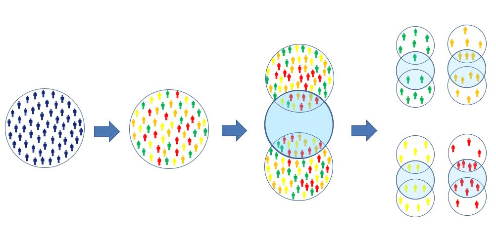

```{r setup, include=FALSE}
knitr::opts_chunk$set(echo = FALSE)
```


<style type="text/css">
slides > slide:not(.nobackground):after {
  content: '';
}
</style>

<style>
div.footnotes {
  position: absolute;
  bottom: 0;
  margin-bottom: 10px;
  width: 80%;
  font-size: 0.6em;
}
</style>

<script src="https://ajax.googleapis.com/ajax/libs/jquery/3.1.1/jquery.min.js"></script>

<script>
  $(document).ready(function() {
    $('slide:not(.backdrop):not(.title-slide)').append('<div class=\"footnotes\">');

    $('footnote').each(function(index) {
      var text  = $(this).html();
      var fnNum = (index+1).toString().sup();
      $(this).html(text + fnNum);

      var footnote   = fnNum + ' ' + $(this).attr('content') + '<br/>';
      var oldContent = $(this).parents('slide').children('div.footnotes').html();
      var newContent = oldContent + footnote;
      $(this).parents('slide').children('div.footnotes').html(newContent);
    });
  });
</script>


## Subgroup analyses
* Generalizing overall treatment effects is often problematic
* Subgroup analyses rarely adequately powered


## Subgroup analyses
Subgroup analyses can be divided into 4 categories (***<footnote content="Varadhan R, Segal JB, Boyd CM, Wu AW, Weiss CO. A framework for the analysis of heterogeneity of treatment effect in patient-centered outcomes research. <em>Journal of clinical epidemiology</em>. 2013 Aug 1;66(8):818-25.">Varadhan et al, 2013</footnote>***):

* Confirmatory heterogeneity of treatment effect analysis	
* Exploratory heterogeneity of treatment effect analysis	
* Descriptive heterogeneity of treatment effect analysis	
* ***Predictive heterogeneity of treatment effect analysis***


## <footnote content="Rekkas, A., Paulus, J.K., Raman, G., Wong, J.B., Steyerberg, E.W., Rijnbeek, P.R., Kent, D.M. and van Klaveren, D., 2020. Predictive approaches to heterogeneous treatment effects: a scoping review. <em>BMC Medical Research Methodology, 20(1)</em>, pp.1-12.">Predictive HTE methods</footnote>
***Risk modeling***

 * A multivariate regression model $f$ that predicts the risk of an outcome $y$ based on the predictors $x_1\dots x_p$ is identified or developed.
 * The expected outcome of a patient receiving treatment $T$ (where $T = 1$, when patient is treated and $0$ otherwise) based on the linear predictor 
 $$lp(x_1,\dots x_p) = a + \beta_1x_1 +\dots\beta_px_p$$ 
 from a previously derived risk model can be described as
 $$E\{y|x_1,\dots,x_p\} = f(lp + \gamma_0T+\gamma T\times lp)$$
 
 
 

## Predictive HTE methods
***Risk modeling (continued)***

 * When the assumption of constant relative treatment effect across the entire risk distribution is made (risk magnification), the previous equation takes the form:
$$E\{y|x_1,\dots,x_p\} = f(lp + \gamma_0T)$$
 


## Predictive HTE methods
***Treatment effect modeling***

The expected outcome of a patient with measured predictors $x_1,\dots,x_p$ receiving treatment $T$ can be derived from a model containing predictor main effects and potential treatment interaction terms:
$$ E\{y|x_1,\dots,x_p\} = f(\alpha + \beta_1x_1+\dots+\beta_px_p+\gamma_0T + \gamma_1Tx_1+\dots+\gamma_pTx_p) $$


## Predictive HTE methods
***Optimal treatment regimes***

A treatment regime $T(x_1,\dots,x_p)$ is a binary treatment assignment rule based on measured predictors. The optimal treatment regime maximizes the overall expected outcome across the entire target population:
$$ T_{optimal} = argmax_TE\big\{ E \{ y|x_1,\dots,x_p,T(x_1,\dots,x_p) \} \big\} $$


## Risk-based HTE
***<footnote content="Kent, D.M., Paulus, J.K., Van Klaveren, D., D'Agostino, R., Goodman, S., Hayward, R., Ioannidis, J.P., Patrick-Lake, B., Morton, S., Pencina, M. and Raman, G., 2020. The predictive approaches to treatment effect heterogeneity (PATH) statement. <em>Annals of internal medicine, 172(1)</em>, pp.35-45.">Reasoning </footnote>***

* When risk is described through a combination of factors the control event rate will typically vary considerably across the trial population. 
* The absolute risk difference will generally vary across risk strata even if the relative risk is the same 
* When a trial population has substantial variation in outcome risk, important differences often exist in harm–benefit tradeoffs


## Risk-based HTE in observational data
***<footnote content="Rekkas, A., van Klaveren, D., Ryan, P.B., Steyerberg, E.W., Kent, D.M. and Rijnbeek, P.R., 2020. A standardized framework for risk-based assessment of treatment effect heterogeneity in observational healthcare databases. <em>arXiv preprint arXiv:2010.06430</em>.">Framework </footnote>***
```{r, fig.align = "center", out.width="90%"}

``` 


## Applications
***Hypertension***

```{r image_htn, fig.show = "hold", out.width = "50%", fig.align = "default"}
knitr::include_graphics(c("Picture5.png", "Picture6.png"))
``` 


## Applications
***Osteoporosis***

```{r image_osteoporosis_1, fig.show = "hold", out.width = "80%", fig.align = "center"}

``` 


## Applications
***Osteoporosis***

```{r image_osteoporosis_2, fig.show = "hold", out.width = "70%", fig.align = "center"}

``` 


## Individualized approaches

* Stratification approach may not provide adequate prediction of benefit
* "Jumps" at cut-offs are not realistic
* Implement a risk-based smoothing approach


## Individualized approaches
Merging treatment arms, we develop prediction models including a constant relative treatment effect:
$$E\{y| x,T\} = P(y| x, T) = f(\alpha+\beta_1x_1+\dots+\beta_px_p+\gamma_0 T)$$
Individualized predictions are derived setting $T=0$.

$$ f_{benefit}(lp | x, \hat{\beta}) = f_{smooth}(lp | x, \hat{\beta},T=0) - f_{smooth}(lp | x, \hat{\beta}, T=1) $$

## Individualized approaches
```{r smooth, fig.show = "hold", out.width = "85%", fig.align = "center"}

