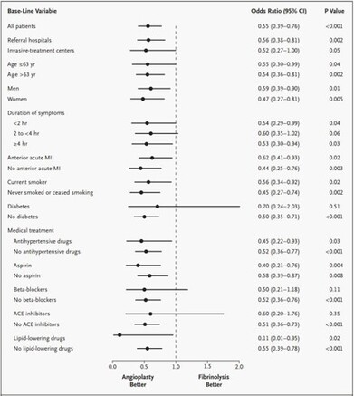
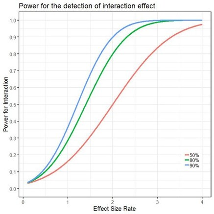

## Subgroup analyses
* Generalizing overall treatment effects is often problematic
* Subgroup analyses rarely adequately powered

## Subgroup analyses
Subgroup analyses can be divided into 4 categories (***Varadhan et al, 2013***):

* Confirmatory heterogeneity of treatment effect analysis	
* Exploratory heterogeneity of treatment effect analysis	
* Descriptive heterogeneity of treatment effect analysis	
* ***Predictive heterogeneity of treatment effect analysis***

## Predictive HTE methods
**Risk modeling:**

 * A multivariate regression model $f$ that predicts the risk of an outcome $y$ based on the predictors $x_1\dots x_p$ is identified or developed.
 * The expected outcome of a patient receiving treatment T (where T = 1, when patient is treated and 0 otherwise) based on the linear predictor 
 $$lp(x_1,\dots x_p) = a + \beta_1x_1 +\dots\beta_px_p$$ 
 from a previously derived risk model can be described as
 $$E\{y|x_1,\dots,x_p\} = f(lp + \gamma_0T+\gamma T\times lp)$$
 
 
 
## Predictive HTE methods
**Risk modeling (continued):**

 * When the assumption of constant relative treatment effect across the entire risk distribution is made (risk magnification), the previous equation takes the form:
$$E\{y|x_1,\dots,x_p\} = f(lp + \gamma_0T)$$
 

## Predictive HTE methods
**Treatment effect modeling:**

The expected outcome of a patient with measured predictors $x_1,\dots,x_p$ receiving treatment $T$ can be derived from a model containing predictor main effects and potential treatment interaction terms:
$$ E\{y|x_1,\dots,x_p\} = f(\alpha + \beta_1x_1+\dots+\beta_px_p+\gamma_1Tx_1+\dots+\gamma_pTx_p) $$

## Predictive HTE methods
**Optimal treatment regimes:**

A treatment regime $T(x_1,\dots,x_p)$ is a binary treatment assignment rule based on measured predictors. The optimal treatment regime maximizes the overall expected outcome across the entire target population:
$$ T_{optimal} = argmax_TE\big\{ E \{ y|x_1,\dots,x_p,T(x_1,\dots,x_p) \} \big\} $$
